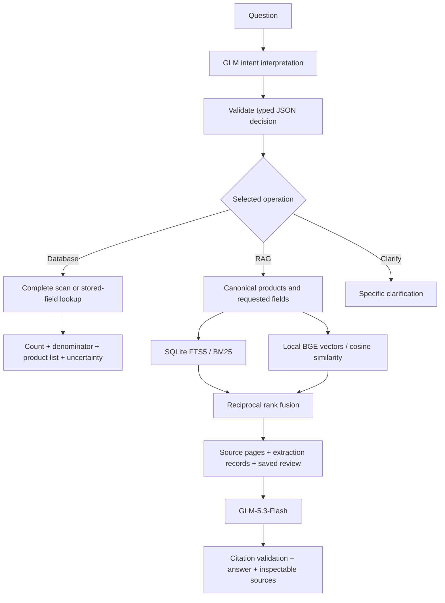

# CMC research assistant: technical design and evaluation

Snapshot: 20 September 2026. Engineering update: 26 September 2026.

## Two question paths

GLM-5.3-Flash first interprets the user's question and returns a JSON decision: database,
RAG, or clarification. It can normalize spelling, stray list numbers and mixed-language phrasing.
The UI shows the normalized question and corrections. A deterministic validator checks routes,
operators, enum values, field names, canonical products, date types and bounds. No model-produced
SQL or Python is executed. Unknown filters and unresolved substantive conditions cannot be
silently accepted. This schema check cannot prove that the model understood every condition;
visible query definitions and adversarial tests remain important.

1. **Structured cohort queries and lookups.** A validated model plan selects stored properties.
   Python scans the complete saved cohort, applies explicit property/date filters and
   counts distinct products. The UI shows the plan, denominator, matching names, evidence
   and unresolved/special cases. No LLM writes or executes SQL or calculates these totals.
2. **Evidence-grounded explanations.** Resolve product names/INNs and requested fields;
   combine keyword and semantic retrieval; attach saved source-linked fields and review
   interpretations; send the bounded evidence to GLM-5.3-Flash through OpenCode Go.
   Missing-value/document responses are deterministic when possible. The routing call still
   uses the model; counts and lookups do not require a second answer-generation call.

## Reproducible retrieval details

- Corpus: 350 CMC documents; 2,434 pages; 6,348 overlapping text chunks; 9,254 fields.
  The 351-product cohort includes one product without a public CMC source.
- Chunking: page-bounded, approximately 1,700 **characters**, 250-character overlap,
  preferring sentence/newline boundaries. This is not a 1,700-token window.
- Embedding: `BAAI/bge-small-en-v1.5`, Qdrant quantized ONNX conversion,
  revision `aa8f8b060edb00e03bfdd08813a2949946c8ba55`, 384 dimensions, 512-token input limit.
  Product names prefix indexed chunks. `passage_embed` and `query_embed` use the same model.
- Storage/search: SQLite retains text and provenance; NumPy stores normalized vectors.
  Exact cosine search is practical for 6,348 chunks, avoiding a separate vector database service.
  Chroma is not used in the current deployment. No learned reranker is implemented.
- Fusion: equal-weight reciprocal rank fusion, score = sum(1/(60 + rank)).
  The raw BM25 and cosine scores are never averaged. Known products constrain both retrievers.
- Context: deduplicate source pages; verified field-linked pages retain full text. Other
  hits retain their chunk text. Page excerpts are not claimed to be complete documents.
  Supply at most eight source passages / 22,000 source characters and 24 field records.
  Round-robin by product prevents one side of a comparison using the whole budget.
- Provenance: `:pN` is a CMC **crop** page; `:fN` is a saved extraction record;
  `:r1` is the current saved-review interpretation. These have different evidence status.
  Corpus and vector hashes prevent accidentally pairing mismatched indexes.
- Runtime: embeddings execute locally on the Streamlit server CPU. No embedding key or
  external embedding service is used. If the local semantic service fails, BM25 remains
  available and the result explicitly identifies the fallback.

## Structured-query scope

Supported filters include ASD review status, salt/non-salt, ASD carrier, polymer as an
excipient, spray drying/HME, dosage form, BCS class, pKa availability and first-authorisation
dates. Unsupported predicates (for example FDA approval, oncology or unsupported negation)
request clarification rather than silently dropping conditions. The literature comparison
is a separate dataset/view and is not used as hidden CMC evidence.

One row is one product, not one molecule. In a combination, different filters may refer
to different API components. Carrier queries include labelled saved inferences by default;
`reported only` narrows that basis. Original extraction records are not overwritten.

Salt status is normalized from the saved salt fields, not inferred from every occurrence
of the word “salt”. Any definite salt API qualifies a product. Excipient salts and covalent
halogens do not qualify. Under the current saved-record rule, the cohort partitions into:

| Status | Products |
|---|---:|
| Salt | 146 |
| Non-salt | 187 |
| Stage-dependent | 3 |
| Coordination / inorganic complex | 5 |
| Unknown | 7 |
| Not applicable | 3 |

Olysio, Qtern and Zontivity have DS/DP conversion issues and are reported separately.
Bylvay has conflicting saved terminology; Voranigo's co-component does not establish
salt versus co-crystal. These are research counting conventions requiring scientist review,
not an EMA-issued “salt drugs” statistic. Raw fields and normalized assignments are inspectable.

## Evaluation performed

Twenty fixed English development/regression questions use the same corpus, product filtering
and known reference pages for BM25, dense and hybrid retrieval. Raw-rank metrics below exclude
the extra source-linked fields; final context coverage includes them. No LLM judges or paid
embedding calls were used. The semantic model was not fine-tuned.

| Method | Known-page hit @5 | Mean known-page recall @8 | Reference coverage in final context |
|---|---:|---:|---:|
| BM25 | 90% | 90% | 95% |
| Dense | 85% | 90% | 90% |
| Hybrid RRF | 85% | 95% | 95% |

The result supports complementarity, **not universal hybrid superiority**. Hybrid improved
recall at eight but did not improve hit rate at five or final context coverage over BM25.
The paraphrase subset had mean page recall @8 of 83.3% / 100% / 100% respectively.
One question describing two nucleosides and the sachet strengths did not retrieve the selected
strength reference page with any method. The failure is retained in `evaluation/results.json`.

Known reference pages were selected by the same assistant that implemented the system.
They are not exhaustive relevance annotations; some other pages may also contain useful evidence.
Questions participated in development. The six “no brand name” questions can still contain
INNs, which may trigger product routing. There is no independent blinded answer-quality score,
and no controlled old-Gemini-versus-new-GLM comparison. Latency includes model warm-up and
is not a cloud SLA. Do not present these results as 95% answer accuracy.

Engineering tests cover deterministic counting after a mocked routing call, negation/unsupported filters, date boundaries,
salt/hydrate distinctions, compound scope, missing pKa, missing documents, comparison context,
citations, English presentation and Streamlit interactions. Provider responses are mocked.

The model-routing update passed 49 offline tests and ten live routing regression cases
(see `evaluation/routing_results.json`). Cases include the exact accidental trailing `2.`,
misspellings, mixed Chinese/English, a misspelt product, complete counts, a comparison,
genuine BCS/date numbers, and unsupported FDA/numeric-threshold conditions. All ten selected
the expected route and tested parameters in this run. This is a small development set,
not an independent accuracy estimate; routing and answer quality remain separate measures.

### Live example follow-up

A Sotyktu/Zelboraf comparison retrieved the correct source pages but returned an empty model
answer during a live demonstration. The client now explicitly requests low reasoning effort
and allows 4,096 completion tokens while retaining the 250-word answer instruction. The
[official GLM-5.3-Flash model card](https://huggingface.co/zai-org/GLM-5.3-Flash)
states that unspecified reasoning effort defaults to max; this is a plausible budget risk,
not a confirmed diagnosis of the original empty response. Truncation is reported separately
from an empty response, and internal reasoning is never shown as a fallback answer.

An initial successful retry also illustrated why valid citations do not prove correctness:
it wrongly generalized an immediate-release designation across both products while also
acknowledging that Zelboraf's release type was not reported. The prompt was tightened to keep
each product's properties separate and answer only the requested properties. Scientific
claim review remains necessary; this prompt change is not an entailment verifier.

## Remaining limitations and scientific review

- Counts inherit extraction/review quality and the declared normalization policy.
- BGE-small is an English embedding model. AI routing translates queries; broad Chinese-language
  performance is not independently validated.
- Numeric/descriptive cross-product questions and unrecognized synonyms can miss evidence.
- Top-k retrieval remains incomplete. It must not supply a cohort denominator.
- Citation validation checks that IDs were supplied, not that every claim is scientifically entailed.
- A single turn is supported; conversational follow-up memory is not implemented.
- The CMC snapshot can cover an earlier formulation (notably Xtandi/Lynparza); later formulations
  cannot be inferred from those documents.
- Next independent validation: a scientist chooses unseen questions and labels acceptable evidence,
  then reviews correctness, unsupported claims, refusal quality and retrieval coverage separately.

## Interview description

“I built a CMC research assistant with two paths: deterministic analysis of structured records
for complete cohort questions, and retrieval-augmented explanations for source-based questions.
An LLM understands the question and proposes the route and typed parameters; deterministic code
validates and executes the plan. This lets users make harmless typos without making the model
responsible for arithmetic or giving it arbitrary database access.
The retrieval combines BM25 with local dense embeddings using reciprocal rank fusion, plus
drug-specific routing and source-linked fields. Answers preserve reported facts versus review
inferences and expose their source pages. I evaluated retrieval methods on the same corpus;
hybrid improved recall at eight on my development set, but I do not claim independently validated
answer accuracy. An important lesson was that counting retrieved passages is not database analysis.”

Official implementation references: [FastEmbed](https://qdrant.github.io/fastembed/Getting%20Started/),
[quantized model](https://huggingface.co/Qdrant/bge-small-en-v1.5-onnx-Q),
[GLM JSON response format](https://docs.z.ai/api-reference/llm/chat-completion).
